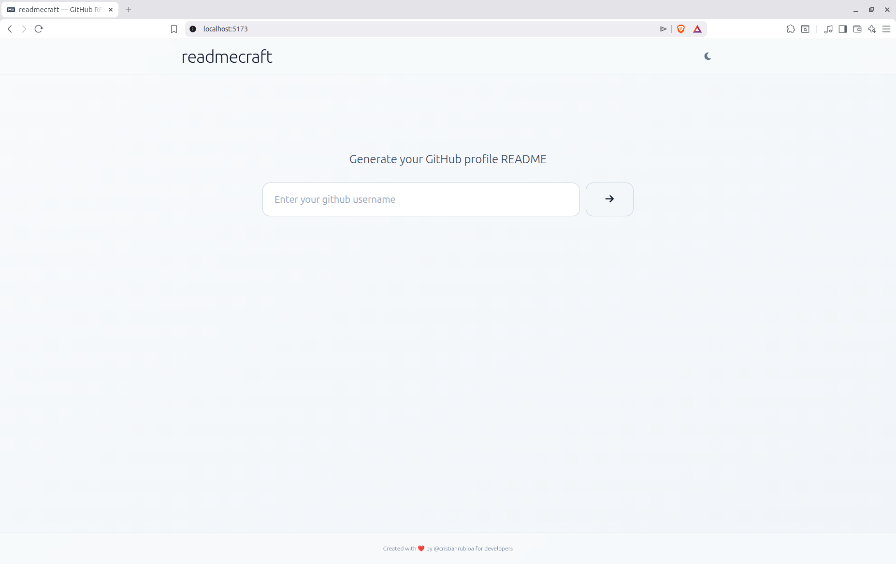
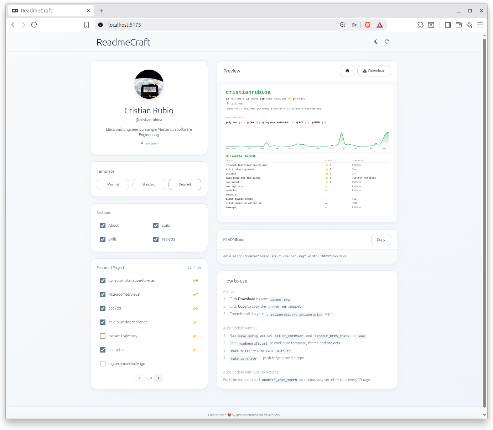

# readmecraft


Generate a GitHub profile README with an SVG banner, contribution chart, and featured projects — via web app or CLI.

<div align="center">
  
  
</div>


**Deploy to Vercel**

[](https://vercel.com/new/clone?repository-url=https://github.com/cristianrubioa/readmecraft)

Or manually:
```bash
npm install
npm run build   # outputs to dist/
```
Point Vercel to the `dist/` directory with framework preset **Vite**.

## Web app

Open the app, enter your GitHub username, pick a template and sections, download `banner.svg`, copy the markdown snippet, and commit both to your `{username}/{username}` profile repo.

**Run locally**
```bash
npm install
npm run dev     # http://localhost:5173
```

## CLI

Generate `output/banner.svg` and `output/README.md` locally without opening the browser.

**Setup**
```bash
make setup      # creates .env from .env.example
                # edit .env → set GITHUB_USERNAME and PROFILE_REPO_TOKEN
```

**Configure** — edit `readmecraft.yml`:
```yaml
template: standard   # minimal | standard | detailed
theme: dark          # dark | light
projects:            # leave empty for no featured projects
  - my-repo
  - another-repo
```

**Run**
```bash
make build           # generates output/banner.svg + output/README.md
make generate        # build + push to your profile repo
make help            # list all targets
```

Override config at runtime without editing the file:
```bash
make build theme=light projects="repo1,repo2"
```

## GitHub Actions

Keeps your profile README up to date automatically — runs on the 1st and 15th of every month.

**Setup**

1. Fork this repo
2. Go to **Settings → Secrets and variables → Actions** and add:
   - `PROFILE_REPO_TOKEN` — Personal Access Token with `public_repo` scope ([create one](https://github.com/settings/tokens))
3. Enable Actions in your fork
4. Trigger manually from **Actions → Update GitHub Profile README → Run workflow** to test

Your GitHub username is read automatically from the repo owner — no extra secret needed.
